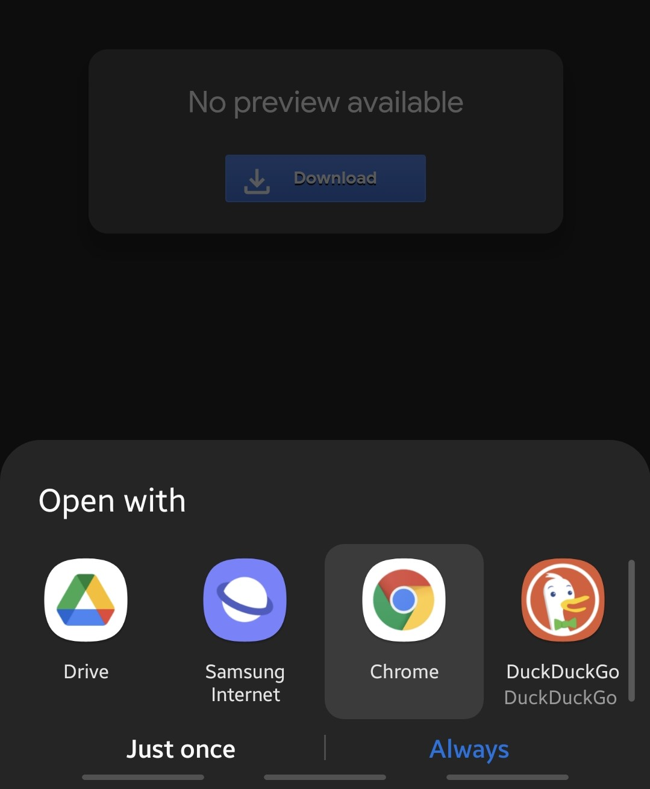
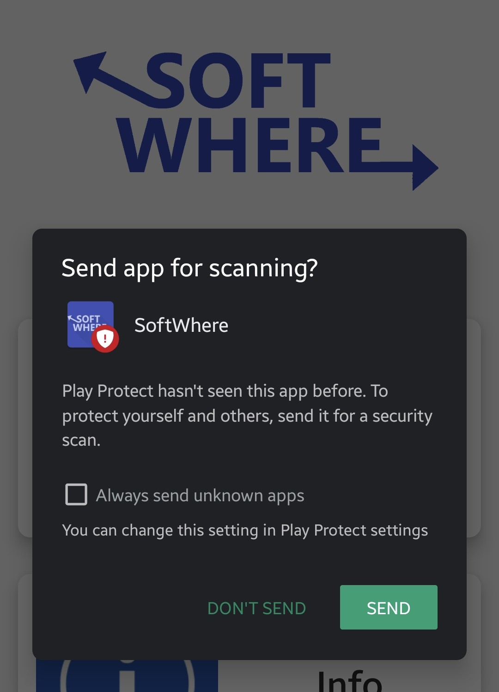

# Project: SoftWhere (App Development)

## Description

SoftWhere is an Android application designed for beginers and aspirants that wish to pursue a career in **Software Development.**   

It contains three sets of features:  
**1. Programming language progress tracker -** Programming Languages are the foundations of Software Development. This section provides the user with a list of programming languages along with its description. At first, all the languages would be *"UNSEEN"* by the user. Three radio buttons are provided beside the language. First one would mark the language as *UNSEEN* with a grey background, second one would mark the language as *START* with a yellow background and the third one would mark the language as *COMPLETED* with a green background. The section also has a search bar for searching programming languages by title.  

**2. Information Bank -** "Information is only useful when it can be understood". This sections contains various cards containing description about the various sub-disciplines of Software Development such as Web Development, Frontend, Backend, Full-Stack. The information will be consolidated in such a manner that even a beginer in programming would be able to understand it and in addition to that it will also provide essential keywords necessary for learning that topic. An alternative purpose of this particular section is to remove any misconceptions regarding these sub-disciplines that might exist due to reasons such as over-popularity and educate the users with practical usage.  

**3. 'Various Jobs' section -** Incentives are an essential part of learning for people who invests their time to learn particular skills. In the case of Software Development where one has to not only tackle numerous open-ended problems, but also come up with creative solutions, strong incentives become an essential factor in one's commitment. For this reason, this section contains job offerenings collected from various websites such as **LinkedIn**, **Indeed**, etc. The monetary incentives provided to Software Developers are usually much higher than most other jobs and this should be able to provide sufficient incentive other that self's passion of the user.

## Prerequisites

* The version 1.0 requires a minimum API Level of 26 (Android Oreo) to run this app.
* The build gradle(app) for this app is:
 
 ```
 apply plugin: 'com.android.application'

android {
    compileSdkVersion 29

    android {
        compileOptions {
            sourceCompatibility JavaVersion.VERSION_1_8
            targetCompatibility JavaVersion.VERSION_1_8
        }
    }

    defaultConfig {
        applicationId "com.example.softwhere"
        minSdkVersion 24
        targetSdkVersion 29
        versionCode 1
        versionName "1.0"

        testInstrumentationRunner "androidx.test.runner.AndroidJUnitRunner"
    }

    buildTypes {
        release {
            minifyEnabled false
            proguardFiles getDefaultProguardFile('proguard-android-optimize.txt'), 'proguard-rules.pro'
        }
    }
}

dependencies {
    implementation fileTree(dir: "libs", include: ["*.jar"])
    implementation 'androidx.appcompat:appcompat:1.3.1'
    implementation 'androidx.constraintlayout:constraintlayout:2.1.0'
    implementation 'androidx.cardview:cardview:1.0.0'
    implementation 'androidx.recyclerview:recyclerview:1.2.1'
    testImplementation 'junit:junit:4.12'
    androidTestImplementation 'androidx.test.ext:junit:1.1.3'
    androidTestImplementation 'androidx.test.espresso:espresso-core:3.4.0'

    implementation 'com.github.bumptech.glide:glide:4.12.0'
    annotationProcessor 'com.github.bumptech.glide:compiler:4.12.0'
    implementation 'com.google.code.gson:gson:2.8.8'
}
 ``` 
 * The extra dependcies as mentioned above are [Glide](https://github.com/bumptech/glide) and [Gson](https://github.com/google/gson).
 * Other than google() and jcenter(), one extra repository is used called mavencentral() which is used to integrate Glide into the project.

 * I have also used several images and information from various website whose URLs are present in "/extra_resources.txt".

 * The size of this app is around 9.57MB.

## Installation

1. Download this [app_debug.apk file](https://drive.google.com/file/d/14eXM19CXHwr3lFwGQziVu8wO4VkuBRvV/view?usp=sharing) from my google drive folder (Only people from 'Indian institute of Technology Tirupati' mailing list can access this file).

2. When the link opens up, click the **"Download"** button. When the **"Open with"** dialog box pops up, Click **"Chrome"** or any browser of your liking.




3. When this widow pops up click on **"Download Anyway"**.


4. A new pop up will appear. Click on **"OK"**.


5. Now open the **Files** application present in your smartphone and go to the **"Downloads"** section. You should be able to see the **"app-debug.apk"** file present there.


6. Tap the **app-debug.apk** file to initiate the installation process.


7. If the below window **(INSTALL UNKNOWN APPS)** opens up then please enable **"Allow from this source"** and then **go back**.


8. Then a new pop up will appear **"Blocked by Play Protect"**. Please click on **"Install anyway"**. Then the installtion process will begin.


9. After the app is installed please click on **"Done"**.


10. When you open the app, a final pop up will appear. Please click on **"Don't Send".**



## Contact

Sagar Singh  
cs19b038@iittp.ac.in  
Indian Institute of Technology, Tirupati.

## P.S.
The main objective of this project is to provide affordable techinal education. In order to achieve this, the application is **free of charge**. In order to gain technical eductaion, searching randomly on the Internet or viewing multiple online courses is both difficult and inefficient. Random searches on Internet either provides useless information or very technical infromation, cited from various websites. Learning from multiple online courses for a single topic can be very expensive and time consuming. This makes finding adequate and reliable information very difficult escpecially when one does not even know the necessary keywords to use for their searches. My app provides a **sense of direction, various paths and an end goal** for its user so that he/she can choose their ideal career in the discipline of **Software Development.**

If I had to use an example to describe this app, using modern trends of eduaction (online courses), I would say that this app is not an online course portal but a guide that would help you *choose* and *judge* a good online course.